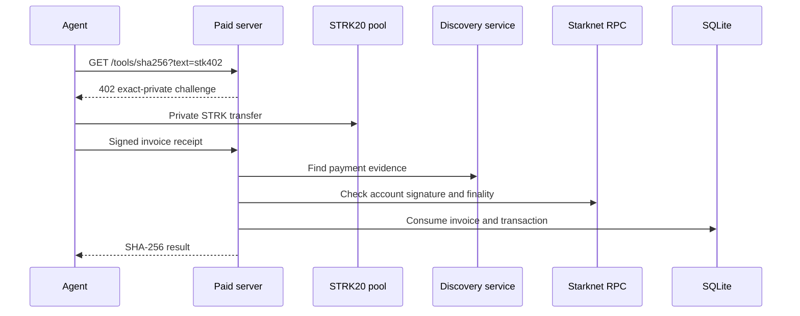

# stk402

Private STRK20 payments for x402 agents on Starknet.

STK402 adds an `exact-private` x402 payment scheme. An agent pays with a private STRK20 transfer. The server verifies the signed receipt, checks the indexed payment, prevents replay, and returns the paid resource.

> Hackathon status: the complete local Devnet flow works. Real Sepolia proof generation and Mainnet settlement have not run yet.

## Current status

| Flow | State | Evidence |
| --- | --- | --- |
| Paid HTTP resource | Verified locally | Loopback request returns `402`, then returns the SHA-256 result after settlement. |
| Private STRK transfer | Verified on Devnet | Alice deposits 100 FRI and transfers 50 FRI to Bob. |
| Private payer funding | Verified on Devnet | The payer deposits 25 FRI. SQLite retry causes no second account execution. |
| Sepolia services | Preflight verified | RPC, pool, discovery, and prover version checks pass. |
| Real Sepolia proof and payment | Not run | Payer secrets and funded STRK are still required. |
| Mainnet payment | Not run | Discovery trust and deployment checks remain open. |

VERIFIED: The local evidence comes from `npm test` and `npm run test:devnet`. Devnet uses test proof facts. It does not generate a real STARK proof.

## How it works

VERIFIED (`src/private402/`): The current vertical slice joins the x402 request, private payment, settlement checks, replay storage, and paid tool.



The receipt binds the invoice ID, transaction hash, recipient, token, amount, network, and absolute expiry. The payer checks the expiry before proving and again before submission.

## Quick start

Install dependencies and run the local checks:

```sh
npm ci
npm run typecheck
npm test
npm run test:devnet
```

The Devnet command builds the pinned Cairo contracts and SDK. It then runs the funding and private payment tests in sequence.

### Check Sepolia services

Create the local environment file:

```sh
cp .env.sepolia.example .env.sepolia
npm run check:sepolia
```

VERIFIED (`src/check-sepolia.ts`): This command reads public data only. It checks the Sepolia chain ID, STRK20 pool, discovery service, and proving service version. It has no signer or transaction call.

VERIFIED: The example uses Alpha Sepolia service URLs. INFERRED: Ask the STRK20 sprint organizers before you depend on their availability. No published availability policy was found.

### Run the paid server

```sh
cp .env.server.example .env.server
npm run serve:paid
```

Fill every `replace_me` value before startup. Keep `STK402_RECIPIENT_VIEWING_KEY` in the local environment or a deployment secret store. Git ignores `.env.server`.

VERIFIED (`src/private402/serve.ts`): The server checks the RPC chain ID before it creates storage or starts listening. It then composes the STRK20 history reader, account signature check, SQLite replay ledger, persistent invoice store, and paid SHA-256 route.

VERIFIED (`src/private402/server-config.ts`): The default invoice lifetime is 900 seconds. Set `STK402_INVOICE_TIMEOUT_SECONDS` when measured proof latency needs more time.

### Fund the private payer

```sh
cp .env.payer.example .env.payer
npm run fund:payer
```

Set `STK402_PRIVATE_FUND_AMOUNT` to the exact FRI deposit. Give each intended deposit a unique `STK402_PRIVATE_FUNDING_ID`. Keep the same ID when retrying an uncertain command.

Set every fee and spend limit before funding. Keep `STK402_PAYER_PRIVATE_KEY` and `STK402_PAYER_VIEWING_KEY` in the local environment or a deployment secret store. Git ignores `.env.payer`.

VERIFIED (`src/private402/fund-payer.ts`): Funding checks both chain IDs, the historical public STRK balance, pool fee, network fee, generated pool call, and proof lifetime. It submits the approval and deposit in one account transaction. It stores the transaction hash before the finality wait.

VERIFIED (`test/devnet/fund-payer.test.ts`): The Devnet test finds the 25 FRI private note. It closes and reopens SQLite. The retry returns the same hash with one account execution.

### Pay for the resource

```sh
npm run pay:resource
```

VERIFIED (`src/private402/pay-resource.ts`): The payer rejects redirects and challenges for another resource. It stores the challenge before payment. A retry resumes the same invoice.

The payer keeps a completed result in SQLite. Clear it only after the caller stores the result:

```sh
npm run pay:ack
```

Stop all payer processes first. If an invoice expires before any payer attempt starts, clear that session:

```sh
npm run pay:recover
```

VERIFIED (`src/private402/payment-recovery.ts`): Recovery refuses to clear a session that has a payer journal entry. An existing attempt needs chain reconciliation. Do not delete the SQLite file to bypass this check.

## Safety model

### Payment checks

VERIFIED (`src/private402/agent-payer.ts`): The payer restricts the network, STRK token, recipient, payment amount, pool fee, network fee, daily STRK spend, pool call, invoice lifetime, and proof data before submission.

VERIFIED (`src/private402/claim-ledger.ts`): An exact retry of an accepted invoice and transaction is idempotent. Another invoice cannot reuse that transaction.

VERIFIED (`src/private402/invoice-store.ts`): The server keeps accepted invoice requirements in SQLite. An exact paid retry can return the resource after invoice expiry and server restart.

VERIFIED (`src/private402/rpc-finality.ts`): Sepolia and Mainnet require a successful `ACCEPTED_ON_L2` or `ACCEPTED_ON_L1` receipt. Starknet documents `ACCEPTED_ON_L2` as consensus final. See the [Starknet transaction lifecycle](https://docs.starknet.io/learn/protocol/transactions).

### Discovery trust boundary

VERIFIED (`vendor/starknet-privacy/sdk/src/internal/indexer-discovery.ts`): The discovery service returns the private transaction history used for settlement. RPC finality confirms the transaction status. It does not independently prove each private note field returned by the discovery service.

INFERRED: A Mainnet operator must trust the configured discovery service. Self-hosting moves this trust to operator-controlled code and RPC infrastructure. The current runtime requires OHTTP support.

See [deploy/README.md](deploy/README.md) for the pinned self-hosted discovery setup.

### Persistent state

VERIFIED (`src/private402/server-config.ts`): Mainnet startup requires HTTPS service URLs, an HTTPS public origin, a filesystem SQLite path, and L2 finality. The paid server does not load a payer private key.

INFERRED: SQLite protects replay only when its path uses persistent storage. An ephemeral container filesystem loses this state after restart.

## Repository map

| Path | Purpose |
| --- | --- |
| [`src/private402/`](src/private402/) | x402 scheme, payer, funding, settlement, storage, and paid tool |
| [`test/devnet/`](test/devnet/) | Real local Devnet funding and private transfer flows |
| [`deploy/`](deploy/) | Self-hosted STRK20 discovery service setup |
| [`vendor/starknet-privacy/`](vendor/starknet-privacy/) | Pinned STRK20 SDK and contracts |
| [`strk20.json`](strk20.json) | Hackathon transaction, contract, and demo metadata |

## Verified commands

```sh
npm run typecheck
npm test
npm run test:devnet
```

VERIFIED on 2026-08-14: `npm test` passed 80 tests. `npm run test:devnet` passed 2 tests. The Devnet suite covered private funding, private transfer, indexer discovery, signed receipt verification, settlement, and retry behavior.

Blind spot: these passing tests do not prove hosted prover behavior, a real STARK proof, Sepolia payment, or Mainnet settlement.
